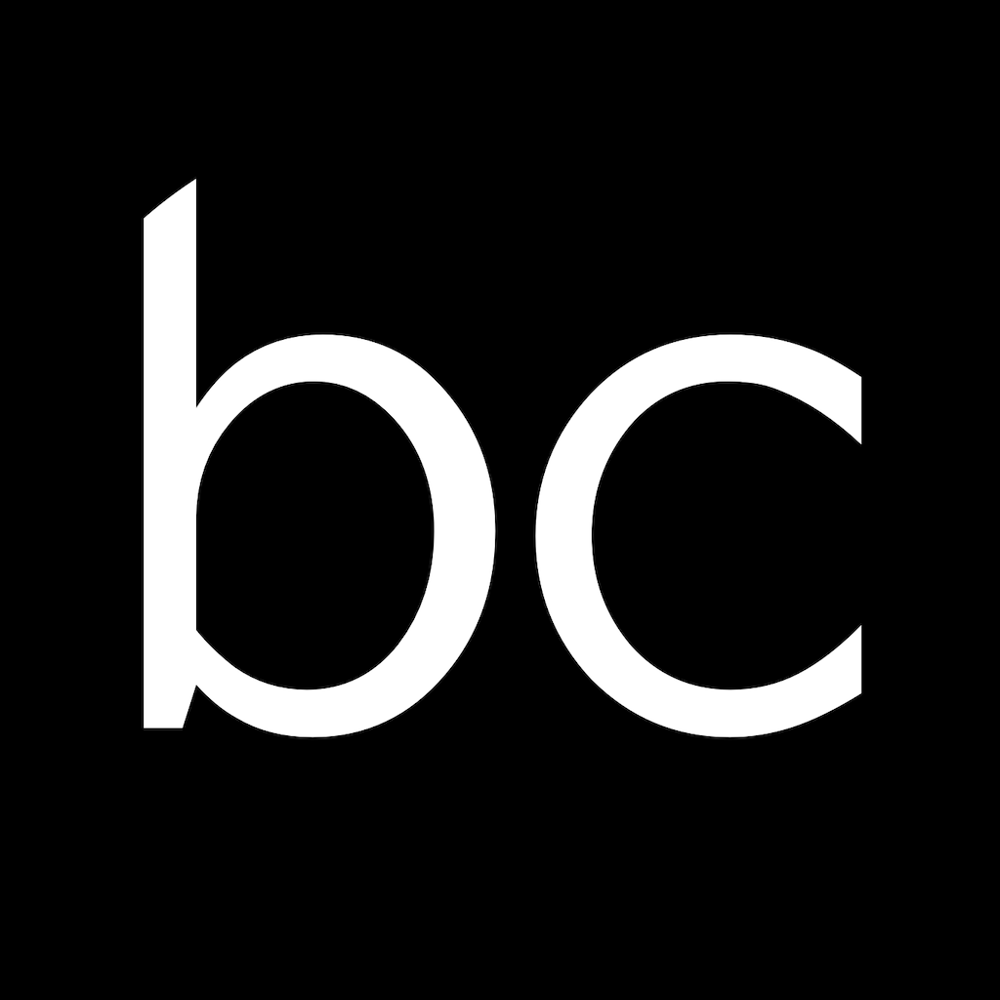
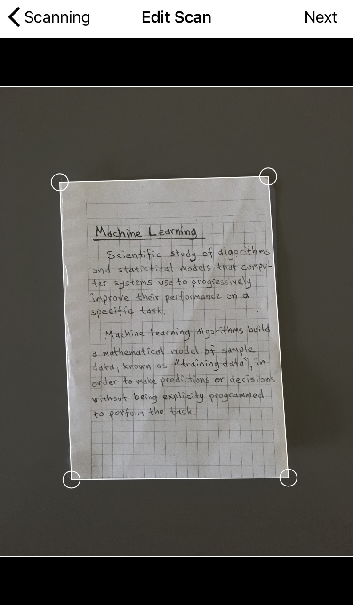
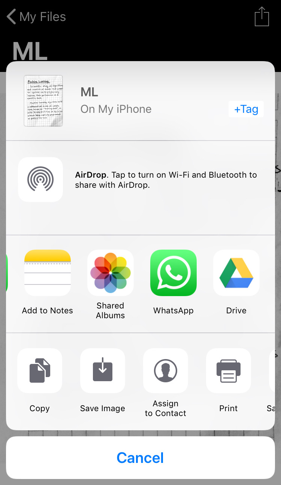

# Betcalsa

    
     
    Document Scanner iOS app written in Swift.

 

## Technologies
* [WeScan](https://github.com/WeTransfer/WeScan)
* [PDFGenerator](https://github.com/sgr-ksmt/PDFGenerator)

## Requirements
- iOS 10.0+
- Xcode 10+
- Swift 4.2

## Screenshots

    
    
    
    

## License

**Betcalsa** is under MIT license. See the [LICENSE](LICENSE) file for more info.